# MPQ Archive File Extraction Workflow

```mermaid
flowchart TD
    %% Main workflow for reading and extracting files from MPQ archives

    Start([Start]) --> OpenFile[Open File]
    OpenFile --> FindHeader{Find MPQ Header}

    %% Header search process
    FindHeader -->|Not Found| ScanNext[+0x200 Bytes]
    ScanNext --> CheckEOF{End of File?}
    CheckEOF -->|Yes| Error1[Error: Not a Valid MPQ]
    CheckEOF -->|No| FindHeader

    FindHeader -->|Found MPQ Header| ReadHeader[Read MPQ Header]
    FindHeader -->|Found User Data| ReadUserData[Read User Data Header]
    ReadUserData --> CalculateOffset[offset += dwHeaderOffs]
    CalculateOffset --> FindHeader

    %% Process MPQ header
    ReadHeader --> GetVersion[Determine MPQ Version]
    GetVersion --> LoadHashTable[Load Hash Table]
    LoadHashTable --> DecryptHashTable[(hash table)]

    %% Handle modern tables based on version
    DecryptHashTable --> CheckVersion{Check Version}
    CheckVersion -->|v1 or v2| ReadBlockTable[Load Block Table]
    CheckVersion -->|v3+| CheckHET{HET Table Present?}

    CheckHET -->|Yes| LoadHETTable[Load HET Table]
    CheckHET -->|No| ReadBlockTable

    ReadBlockTable --> DecryptBlockTable[(block table)]
    DecryptBlockTable --> CheckHiBlockTable{Version >= 2?}
    CheckHiBlockTable -->|Yes| LoadHiBlockTable[Load Hi-Block Table]
    CheckHiBlockTable -->|No| InitComplete[Initialization Complete]
    LoadHiBlockTable --> InitComplete
    LoadHETTable --> CheckBET{BET Table Present?}
    CheckBET -->|Yes| LoadBETTable[Load BET Table]
    CheckBET -->|No| InitComplete
    LoadBETTable --> InitComplete

    %% File access workflow
    InitComplete --> GetFilename[Get Filename to Extract]

    %% Try to use listfile if available
    GetFilename --> CheckListfile{?}
    CheckListfile -->|Yes| ReadListfile[(listfile)]
    ReadListfile --> HasListEntry{File in Listfile?}
    HasListEntry -->|Yes| HashFilename[Hash Filename]
    HasListEntry -->|No| HashFilename
    CheckListfile -->|No| HashFilename

    %% Hash and find file
    HashFilename --> CalculateHashes[A, B, and Table Offset]
    CalculateHashes --> CheckVersion2{Version >= 3 with HET?}

    %% Different search procedures based on tables
    CheckVersion2 -->|Yes| SearchHETTable[Using Jenkins Hash]
    CheckVersion2 -->|No| SearchHashTable[Using Calculated Offset]

    SearchHashTable --> FoundInHashTable{File Found?}
    FoundInHashTable -->|No| Error2[Error: File Not Found]
    FoundInHashTable -->|Yes| GetBlockIndex[Get Block Table Index]

    SearchHETTable --> FoundInHETTable{File Found?}
    FoundInHETTable -->|No| Error2
    FoundInHETTable -->|Yes| GetBETInfo[Get File Info from BET]

    %% Get file information
    GetBlockIndex --> ReadBlockEntry[Read Block Table Entry]
    GetBETInfo --> FileInfoComplete[File Information Complete]
    ReadBlockEntry --> CheckFileFlags[Check File Flags]
    CheckFileFlags --> FileInfoComplete

    %% Process file data
    FileInfoComplete --> ReadFileData[Read File Data]
    ReadFileData --> CheckCompressed{Is Compressed?}
    CheckCompressed -->|Yes| ReadSectorTable[Read Sector Offset Table]
    ReadSectorTable --> ProcessSectors[Process Each Sector]

    ProcessSectors --> CheckEncrypted{Is Encrypted?}
    CheckEncrypted -->|Yes| DecryptSector[Key: Based on Filename]
    DecryptSector --> CheckSectorCRC{Has CRC?}
    CheckEncrypted -->|No| CheckSectorCRC

    CheckSectorCRC -->|Yes| VerifyCRC[Verify Sector CRC]
    VerifyCRC --> DecompressSector[Decompress Sector]
    CheckSectorCRC -->|No| DecompressSector

    DecompressSector --> AllSectorsProcessed{All Sectors Done?}
    AllSectorsProcessed -->|No| ProcessSectors
    AllSectorsProcessed -->|Yes| FileComplete[File Data Complete]

    CheckCompressed -->|No| ReadWholeFile[Read Whole File]
    ReadWholeFile --> CheckFileEncrypted{Is Encrypted?}
    CheckFileEncrypted -->|Yes| DecryptFile[Key: Based on Filename]
    DecryptFile --> FileComplete
    CheckFileEncrypted -->|No| FileComplete

    FileComplete --> WriteFile[Write Extracted File]
    WriteFile --> Success([Extraction Complete])

    %% Error states lead to end
    Error1 --> End([End])
    Error2 --> End
    Success --> End
```

## MPQ Extraction Process Explanation

The workflow diagram above illustrates the complete process for extracting files from an MPQ archive. Here's a detailed explanation of each phase:

### Phase 1: Archive Initialization

1. **Open the file** - Open the target MPQ file for binary reading
2. **Find the MPQ header** - Scan the file at 512-byte offsets until finding either an MPQ header or user data header
3. **Process headers** - If a user data header is found, calculate the new offset and continue searching
4. **Read MPQ header** - Once the MPQ header is found, determine the format version and load necessary tables

### Phase 2: Table Loading

5. **Load Hash Table** - Read the hash table and decrypt it using the key "(hash table)"
6. **Load Block Table** - Read the block table and decrypt it using the key "(block table)"
7. **Version-Specific Tables** - For version 2+, load the Hi-Block table; for version 3+, load HET/BET tables if present

### Phase 3: File Lookup

8. **Get Filename** - Get the name of the file to extract
9. **Use Listfile** - If available, read the (listfile) to obtain a list of filenames in the archive
10. **Hash Calculation** - Calculate the three hash values for the filename (A, B, and table offset)
11. **Search Tables** - Search the hash table (or HET table for version 3+) to find the file

### Phase 4: File Extraction

12. **Get File Information** - Retrieve file information from the block table or BET
13. **Read File Data** - Read the raw file data from the archive
14. **Process File** - Process the file based on its flags:
    - For compressed files, read the sector offset table and process each sector
    - For each sector, perform decryption (if needed), verify CRC (if present), and decompress
15. **Write File** - Write the processed file data to the output location

### Common Challenges

- **Path Normalization** - Ensure proper path separator handling when hashing filenames
- **Locale Handling** - Account for multiple language versions of the same file
- **Encryption Keys** - Correctly calculate file encryption keys based on filename and flags
- **Compression Chains** - Handle multiple compression methods that may be applied to a single sector

This workflow represents the standard procedure for extracting files from MPQ archives across all format versions. Specific implementation details may vary based on the MPQ version and the features used in the archive.
